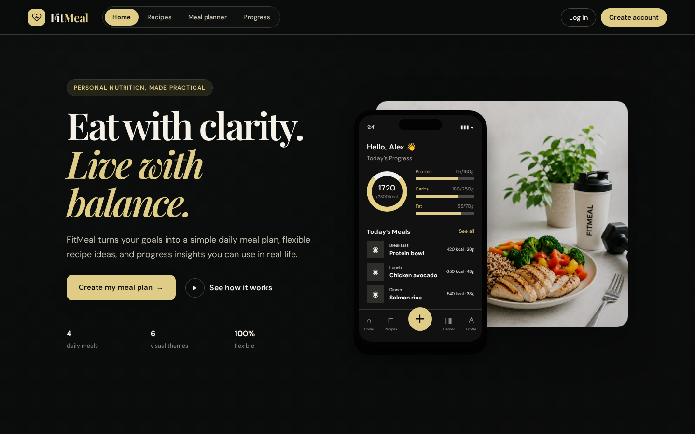
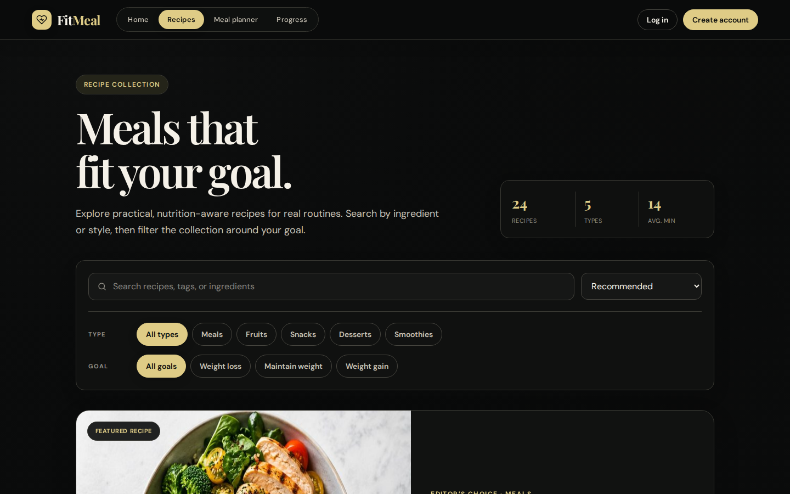
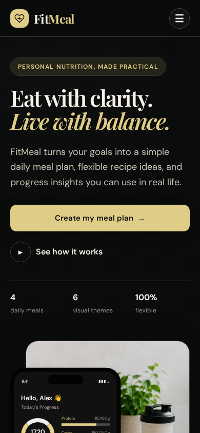
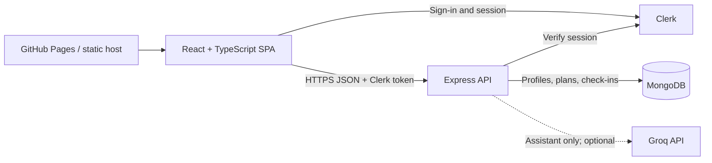

# FitMeal

[](https://github.com/razidorra/Fitmeal/actions/workflows/ci.yml)

**Live demo:** [razidorra.github.io/Fitmeal](https://razidorra.github.io/Fitmeal/) (public static build)

FitMeal is a full-stack meal-planning application built with TypeScript. It combines a public recipe collection with account-scoped profiles, daily meal plans, weight check-ins, rule-based progress reviews, and an optional Groq-powered nutrition assistant.

> The public frontend is online on GitHub Pages. The current source still needs to be redeployed and connected to the Express API, MongoDB Atlas, and matching Clerk variables before the production full-stack release is complete; see the [deployment guide](docs/DEPLOYMENT.md).

FitMeal is an educational planning aid. Nutrition values are estimates and the application does not provide medical or dietetic advice.

## Features

- Public home page and a responsive 24-recipe collection with search, goal/category filters, sorting, a featured recipe, nutrition details, and an optional sign-in prompt before opening the detail modal.
- Clerk authentication with a custom account summary, responsive account navigation, visible desktop/mobile sign-out controls, and per-user data ownership.
- Editable nutrition profile with calorie and macro targets calculated from the Mifflin-St Jeor formula.
- One persisted meal plan per local calendar day, deterministic menu variety, goal-specific choices, manual refresh, and a Sunday free-choice day.
- Per-meal confirmation or free-text replacement while preserving the original suggestion and recipe details.
- Two-week plan history grouped into this week and the previous week.
- A progress dashboard with optional check-in context, a theme-aware weight chart, history, and a deterministic review based on weight direction and the latest meal log.
- Groq-powered assistant chat in the Meal Planner and in a floating site-wide panel for signed-in users.
- Clearly labelled offline assistant guidance when Groq is unavailable or not configured.
- Six account-specific visual themes stored on the current device; signed-out pages return to Midnight Gold automatically.
- Page-level error boundaries plus loading, empty, guest, and error states for asynchronous screens.

## Screenshots

| Desktop home | Recipe discovery |
| --- | --- |
|  |  |

<p align="center">
  
</p>

## Technology

| Area | Stack |
| --- | --- |
| Frontend | React 18, Vite 6, TypeScript, TanStack Router, Tailwind CSS 4 |
| Backend | Node.js, Express 5, TypeScript, Zod |
| Data | MongoDB, Mongoose |
| Authentication | Clerk (`@clerk/react`, `@clerk/express`) |
| Assistant | Groq chat completions API |
| Tests | Vitest, React Testing Library, Supertest, `mongodb-memory-server`, Playwright |
| Workspace | npm workspaces |

## Architecture



The frontend owns rendering and interaction, while API calls stay in one shared client. The backend validates every request and checks Clerk ownership before accessing MongoDB records. Meal swaps and progress reviews are deterministic; only assistant chat can call Groq, and it has a labelled offline fallback.

## Project structure

```text
frontend/src/features/       page and feature components
frontend/src/routes/         TanStack Router layout and routes
frontend/src/shared/         API client, shared types, themes, reusable UI
frontend/public/images/      static site and recipe images
backend/src/features/        profile, meal-plan, progress, and assistant features
backend/src/shared/          auth, ownership, database, and Groq helpers
backend/src/test/            shared test database lifecycle
docs/                        specification, audit history, and deployment guide
render.yaml                  Render Blueprint for the API and frontend
```

## Run locally

### Prerequisites

- A current Node.js LTS release with npm.
- A MongoDB database. MongoDB Atlas is suitable; tests do not use this database.
- A Clerk application for account-backed planner, progress, recipe-detail, account, and assistant features.
- Optionally, a Groq API key for live assistant responses.

### Setup

1. Install both workspaces from the repository root:

   ```bash
   npm install
   ```

2. Create local environment files from the tracked examples:

   ```bash
   cp backend/.env.example backend/.env
   cp frontend/.env.example frontend/.env
   ```

3. Add your MongoDB and matching Clerk keys. Add a Groq key if live AI replies are wanted.
4. Start both applications:

   ```bash
   npm run dev
   ```

5. Open `http://localhost:5173`. The API runs at `http://localhost:4000`, and Vite proxies local `/api` requests to it.

The canonical backend environment file is `backend/.env`. `backend/src/.env` is read only as a temporary compatibility fallback and should be moved to `backend/.env` for new setups.

## Demo instructions

### Public hosted demo

1. Open the [live demo](https://razidorra.github.io/Fitmeal/).
2. Check the responsive home page and use **Recipes** to search, filter by type/goal, and change sorting.
3. Try a recipe card and visit an unknown URL to see the guest/configuration and application-level error states.

GitHub Pages serves static files only. If the current deployment has not yet been connected to the hosted API and Clerk, planner/account/progress actions will show setup guidance rather than pretending to save data.

### Full-stack demo flow

After following the local setup above or the [production deployment steps](docs/DEPLOYMENT.md):

1. Sign up or sign in with Clerk.
2. Open **Meal planner**, create a profile, and inspect the generated daily targets and four meal budgets.
3. Confirm one suggested meal, record a different meal, refresh, and reload to demonstrate MongoDB persistence.
4. Add weight check-ins on **Progress** and request the deterministic trend review.
5. Ask the assistant a nutrition question; remove `GROQ_API_KEY` to demonstrate graceful offline guidance.
6. Change theme under **Account**, then use the two-step privacy control to delete the stored FitMeal data.

## Environment variables

### Backend (`backend/.env`)

| Variable | Required | Purpose |
| --- | --- | --- |
| `PORT` | No | API port; defaults to `4000` |
| `NODE_ENV` | Production only | Enables fail-fast production configuration and proxy behavior |
| `MONGODB_URI` | Yes for data features | MongoDB connection string |
| `CLERK_PUBLISHABLE_KEY` | Yes for protected features | Backend Clerk configuration |
| `CLERK_SECRET_KEY` | Yes for protected features | Verifies Clerk sessions |
| `CORS_ORIGINS` | Production only | Comma-separated browser origins allowed to call the API |
| `GROQ_API_KEY` | No | Enables live FitMeal AI answers |
| `GROQ_MODEL` | No | Groq model; defaults to `openai/gpt-oss-20b` |

### Frontend (`frontend/.env`)

| Variable | Required | Purpose |
| --- | --- | --- |
| `VITE_CLERK_PUBLISHABLE_KEY` | Yes for account and recipe-detail features | Enables Clerk UI, recipe-detail gating, and authenticated requests |
| `VITE_API_PROXY_TARGET` | No | Local Vite proxy target; defaults to `http://localhost:4000` |
| `VITE_API_URL` | Production only | Public API base URL including `/api` |
| `VITE_BASE_PATH` | Subpath deployments only | URL path where the frontend is hosted; the GitHub Pages workflow derives it from the repository name |

Use the same Clerk application on the frontend and backend. If Clerk is not configured, the home page and recipe collection remain visible, but recipe details, planner, progress, account, and assistant features show configuration guidance. If only one side is configured, authenticated data requests cannot work correctly.

Never commit `.env` files, database credentials, Clerk secrets, or API keys.

Recipe cards and direct `/recipes/:recipeSlug` links both require a signed-in Clerk session before rendering full details. Because the static recipe data ships in the frontend bundle, this is a product-access gate rather than protection for sensitive information.

## How meal planning works

The planner accepts age, a Mifflin–St Jeor equation choice, height, weight, activity level, and goal. That formula publishes male (+5) and female (−161) constants; the “Other / prefer not to say” option explicitly uses −161 rather than silently falling through. The backend calculates a daily target, then assigns one Breakfast, Lunch, Snack, and Dinner. Menu selection is deterministic from the profile goal, local date, and meal slot, so reloads preserve a day while different days rotate through the available pool.

The first planner visit on a date creates that day's plan. Later visits return the saved plan, preserving confirmations and replacements. **Refresh plan** intentionally replaces the current day's saved plan. A compound database index guarantees one plan per profile and date. Every Sunday is represented as a free-choice day without fixed meals, calorie displays, or confirmation controls.

Meal-level calories and protein are target budgets allocated from the daily estimate, not laboratory nutrition calculations for the displayed ingredient quantities. The interface labels them accordingly so users can adjust portions rather than treating them as exact recipe measurements.

Meal confirmation, meal replacement, and progress review are rule-based and never call Groq. A replacement records the user's description but retains the original suggested meal's title, image, ingredients, and preparation steps. Because FitMeal does not estimate free-text nutrition, the slot keeps its original calorie/protein budget for display.

## AI assistant

The assistant chat is the only feature that calls an AI service. Signed-in users can use it from the Meal Planner or the floating launcher on any route. Configure it with:

```env
GROQ_API_KEY=your_key_here
GROQ_MODEL=openai/gpt-oss-20b
```

If Groq is missing, unavailable, or over quota, the API returns clearly labelled basic offline guidance for supported nutrition questions. The rest of FitMeal remains independent of Groq.

## Commands

Run these from the repository root:

```bash
npm run dev      # run frontend and backend in watch mode
npm run build    # type-check/build the frontend, then build the backend
npm test         # run frontend and backend test suites once
npm run test:e2e # run Playwright browser tests (builds/serves a public local frontend by default)
```

Workspace-specific alternatives:

```bash
npm run build -w frontend
npm run build -w backend
npm run test -w frontend
npm run test -w backend
npm run test:watch -w backend
```

Frontend Vitest/Testing Library tests cover configuration fallbacks, dates, filters, forms, guest prompts, modal focus, API failures, and meal confirmation/replacement. Playwright covers public navigation, app-relative section links, filtering, and unknown routes; it is also prepared to exercise the deployed Clerk-backed profile → plan → meal log → progress journey when the deployment credentials below are supplied. The authoritative frontend type check remains `npm run build`, which runs `tsc -b` before the Vite production build. Backend tests cover calculations, meal-plan selection and uniqueness, assistant fallback guidance, validation, security responses, persisted plan/review behavior, authentication, and cross-user ownership using an ephemeral in-memory MongoDB.

Authenticated browser tests deliberately target a deployed test environment so they exercise the real Clerk/API/MongoDB boundary. Use a dedicated Clerk test user and never commit these values:

```bash
E2E_BASE_URL=https://your-frontend.example/optional-base-path \
CLERK_PUBLISHABLE_KEY=pk_test_... \
CLERK_SECRET_KEY=sk_test_... \
E2E_CLERK_USER_EMAIL=fitmeal+clerk_test@example.com \
npm run test:e2e -- --project=authenticated-chromium
```

Without those variables the authenticated project is reported as skipped; the public Chromium project still runs locally and in CI.

## API routes

All routes except health require a valid Clerk session. Resource routes also verify ownership; requests for another user's profile or related records return `404`.

| Method | Route | Purpose |
| --- | --- | --- |
| `GET` | `/api/health` | API and MongoDB readiness check |
| `GET` | `/api/profiles/latest` | Read the signed-in user's latest profile |
| `POST` | `/api/profiles` | Create a profile |
| `PATCH` | `/api/profiles/:profileId` | Update an owned profile |
| `DELETE` | `/api/profiles/:profileId` | Delete an owned profile and its plans/check-ins |
| `POST` | `/api/meal-plans/generate/:profileId` | Get/create a dated plan, or regenerate it |
| `GET` | `/api/meal-plans/latest/:profileId` | Read the most recently created plan |
| `GET` | `/api/meal-plans/:profileId/history` | Read recent dated plans; `days` defaults to 14 and is capped at 60 |
| `POST` | `/api/meal-plans/:planId/meals/:time` | Save a free-text meal replacement |
| `PATCH` | `/api/meal-plans/:planId/meals/:time/confirm` | Confirm the suggested meal |
| `GET` | `/api/progress/:profileId` | Read weight check-ins |
| `POST` | `/api/progress` | Add a weight check-in |
| `POST` | `/api/progress/:profileId/review` | Build a rule-based progress review |
| `POST` | `/api/assistant/chat` | Ask the Groq-backed assistant, with local fallback |

The API applies Helmet security headers, a 64 KB JSON-body limit, a general request limit, and a stricter assistant-specific limit. Production accepts only origins listed in `CORS_ORIGINS`. Validation errors return `400`, duplicate records return `409`, oversized bodies return `413`, rate limits return `429`, and unexpected failures are logged server-side while clients receive a generic `500` response.

## Privacy and data deletion

- Clerk manages authentication identity and sessions. FitMeal stores the Clerk user ID on its own profile only so API ownership can be enforced.
- MongoDB stores the nutrition profile, generated meal plans, meal confirmations/replacements, and weight check-ins. Other signed-in accounts receive `404` instead of access to those records.
- Theme preference is stored locally in the browser for the current Clerk user.
- Assistant messages are sent to Groq only when the optional live assistant is enabled; FitMeal does not persist chat history in MongoDB.
- Under **Account → Privacy and data**, **Delete my FitMeal data** requires a second confirmation and removes the signed-in user’s profile, plans, check-ins, and local theme preference. It leaves the Clerk sign-in identity active because Clerk account deletion is managed separately.

Do not enter medical records or other sensitive health information. FitMeal is an educational planning project, not a medical service.

## Challenges and what I learned

- **Static frontend versus full stack:** GitHub Pages cannot execute Express, so I learned to separate static deployment from API hosting and compile the complete `/api` URL into Vite only after the backend exists.
- **Authentication is not authorization:** validating a Clerk session was only the first step. Every profile, plan, and check-in query also needed an ownership condition, including deletion and `404` behavior for cross-account requests.
- **Nutrition integrity matters:** fixed ingredient ideas cannot honestly produce different measured nutrition for different users. I changed the per-meal figures into clearly labelled target budgets and made the Mifflin–St Jeor equation choice explicit.
- **Failure states are part of the product:** missing Clerk/Groq configuration, validation failures, API errors, empty histories, unknown routes, and database readiness now have deliberate behavior rather than blank screens.
- **Confidence comes from layers of tests:** pure calculations, real ephemeral MongoDB route tests, React interaction tests, and Playwright browser journeys catch different classes of mistakes. CI runs the complete build and test boundary on every main-branch push and pull request.

## Deployment and remaining handoff work

The repository includes a Render Blueprint for a free Node web service and static frontend, plus a GitHub Actions workflow (`.github/workflows/deploy-pages.yml`) that publishes the frontend to GitHub Pages. The Pages base path is derived from the repository name, so forks do not require source edits. The API (and MongoDB) still needs to run on a Node host because GitHub Pages only serves static files. Follow [the deployment guide](docs/DEPLOYMENT.md) to deploy the current source, configure MongoDB/Clerk/Groq, connect the frontend URL to the API, and complete the production smoke test.

Before calling a release complete:

1. Run `npm run build` and `npm test`.
2. Deploy the Blueprint and configure all required service variables.
3. Add the deployed frontend origin/redirect URLs in Clerk and allow the API to reach MongoDB Atlas.
4. Verify health, sign-up/sign-in/sign-out, profile creation/editing, daily plan generation, meal logging, history, check-ins, progress review, themes, mobile navigation, direct recipe URLs, and both live/fallback assistant behavior.
5. Set `CORS_ORIGINS` to the deployed frontend origin; production startup fails when required configuration is missing.

## Documentation

- [Product specification and release status](docs/SPEC.md)
- [Deployment guide](docs/DEPLOYMENT.md)
- [Dated implementation audit](docs/AUDIT.md)
- [Contributor/development guide](AGENTS.md)
- [Recipe image notes](frontend/public/images/recipes/README.md)

## Author

Built by **Razi** — [GitHub / portfolio](https://github.com/razidorra) · [dorra.razi@gmail.com](mailto:dorra.razi@gmail.com)

## License

No open-source license is currently included, so the project remains all rights reserved. Contact the author before reusing substantial parts of the code. An MIT license can be added later if public reuse is intended.
